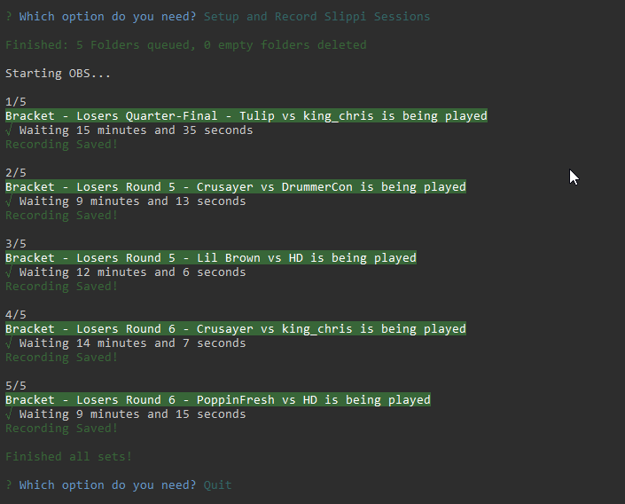

# SlpTOTools

Tools for publishing VODS to youtube and organization

This CLI achieves the following:

-   Generates a folder for each set from a complete challonge event
-   Ganerates a folder for each set from a completed smash.gg event
-   Creates a queue.json and bat file to run an queue of .slp files
-   Clears empty generated folders
-   Automates OBS Studio to record a list of sets as individual videos of your choice of format.

Resulting in able to play slippi files as a complete set as an mp4/flv/etc with playback controls! The only thing your are responsible for is remembering which slp files go to each set/folder.




_Warning: Windows machine only at the moment. Eventually I will add support to other OS but I do not have a Mac product so it will probably be the last to get support._

## In order to use this tool

-   Please install a somewhat modern version NodeJS. - https://nodejs.org/en/
-   Download OBS Studio - https://obsproject.com/
-   Download OBS websocket - https://github.com/Palakis/obs-websocket/releases
-   Download Slippi Launcher - https://slippi.gg/downloads

## Installation

```
npm install
```

Before using for the first time.

## Enviormental Variables

Before running the program make sure you create a .env file in the root folder of the project. Depending on your needs you will need specific variables to be included. Use the .env.example file as a template and copy the correct values.

### Needed for everything

-   DIR = Target Directory of your video outputs as well as your collected slippi files

### Needed for Recording

-   ISO = Melee ISO used for dolphin
-   DOLPHIN = Dolphin execuatable used for replaying slippi files
-   OBS_PORT = Part for obs-websocket
-   OBS_PASS = Password for obs-websocket
-   OBS_SCENE = Scene used for OBS recording

### Needed for Smash.gg Folder generation

-   GG_SLUG = slug for the event you are targeting ex: tournament/smash-uofa-46-jan-24/event/melee-singles
-   GG_API = Smash.gg API Key need to request key from smash.gg staff

### Needed for challonge Folder generation

-   CHALLONGE_EVENT = slug for the event you are targeting ex: 34rovbp3
-   CHALLONGE_API = challonge API Key, check account settings on challonge account

## Setting up the OBS Scene

On OBS create a scene for your slippi recording.
Create a Game Capture or window capture of the dolphin.exe that will be running the replays. Easiest way to catch this is playing a slp file via slippi launcher.

Finally go to tools -> websocket server settings to choose your port and password.

## Running Program

```
npm start
```

You can create your own folders for how to divide the slp files or you can use the first two opinions to generate the folders for you if you have a proper API key.

The third opinion creates a queue.json which is necessary to feed the dolphin exe to tell which slp files to play in sequence. It will also create a windows batch file that the program will use to play the dolphin emulation for the recording phase.

Before you start the recording option, make sure OBS is already running!

## TODO List

-   [x] Finish Documentation (For now!)
-   [x] Add enviorment variables to record.ts
-   [] Add missing typings
-   [x] Add example images to Readme
-   [x] Create .env.example
-   [] Youtube Integration (Maybe!)
